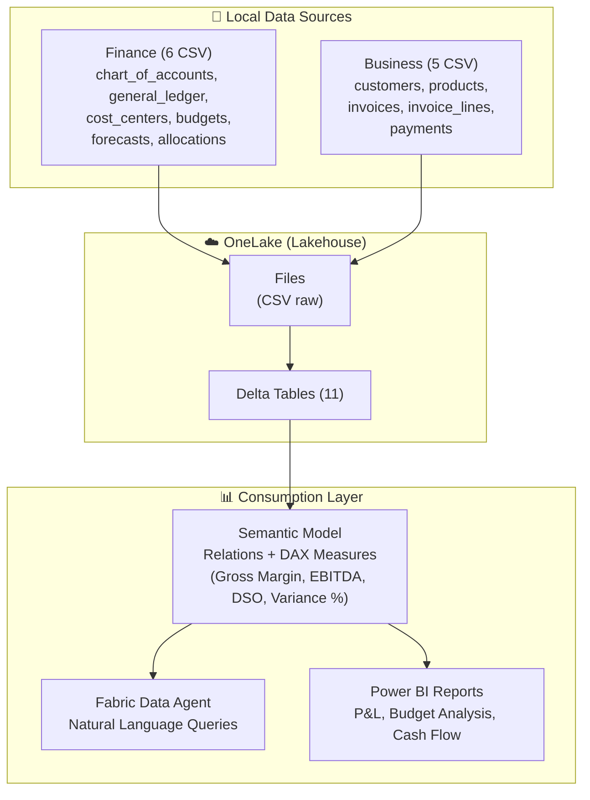

# Finance Performance Management - Microsoft Fabric Demo

Démo complète Microsoft Fabric illustrant **OneLake**, **Shortcuts**, et **Fabric Data Agent** avec un cas d'usage **Finance Performance Management** (P&L, Budget vs Actual, Cash Flow).

---

## 🎯 Objectif

Démontrer Microsoft Fabric avec :
- **11 tables relationnelles** (Finance + Business)
- **Analyses financières** (P&L, Budget vs Actual, Variance Analysis)
- **KPIs Finance** (Marge brute, EBITDA, DSO, Cash Flow)
- **Data Agent** pour questions CFO en langage naturel

---

## 📐 Architecture



---

## 📊 Données Générées

### Tables Finance (6)
| Table | Lignes | Description |
|-------|--------|-------------|
| `chart_of_accounts` | ~150 | Plan comptable (comptes de classe 1-7) |
| `general_ledger` | ~50 000 | Grand livre (écritures journal) |
| `cost_centers` | 13 | Centres de coûts (Sales, Marketing, R&D...) |
| `budgets` | ~2 000 | Budgets mensuels par CC et compte |
| `forecasts` | ~6 000 | Reforecasts trimestriels (Q2, Q3, Q4) |
| `allocations` | ~65 | Allocations de coûts indirects |

### Tables Business (5)
| Table | Lignes | Description |
|-------|--------|-------------|
| `customers` | 500 | Clients (Enterprise, Mid-Market, SMB) |
| `products` | 50 | Catalogue produits (4 catégories) |
| `invoices` | 8 000 | Factures clients |
| `invoice_lines` | ~20 000 | Lignes de factures (détail produits) |
| `payments` | ~7 000 | Paiements reçus (DSO tracking) |

**Total** : 11 tables = **~87 000 lignes de données**

---

## 🚀 Quick Start

### 1. Générer les Données

```powershell
# Cloner le repo et installer les dépendances
cd "Scenario 4 - Finance\src"
pip install -r ..\requirements.txt

# Générer les données
python generate_data.py
```

**Sortie attendue** :
```
✅ Génération terminée avec succès!
📊 Statistiques:
  - Comptes comptables: 150
  - Centres de coûts: 13
  - Lignes budgétaires: 2000+
  - Écritures GL: 50 000+
  - Clients: 500
  - Factures: 8 000
  - Paiements: 7 000+
```

**Fichiers générés** :
- `data/raw/finance/` : 6 fichiers CSV
- `data/raw/business/` : 5 fichiers CSV

### 2. Déployer dans Microsoft Fabric

Suivre le guide [`docs/fabric_setup.md`](docs/fabric_setup.md) :
1. Créer un Lakehouse
2. Uploader les CSV via OneLake
3. Créer des tables Delta
4. Créer un Semantic Model avec relations
5. Configurer le Data Agent

### 3. Tester le Data Agent

Poser des questions en langage naturel :
- *"Pourquoi la marge brute baisse ce trimestre ?"*
- *"Quels centres de coûts ont dépassé leur budget ?"*
- *"Quel est le DSO actuel et quels clients le dégradent ?"*
- *"Affiche-moi le P&L consolidé"*

Voir [`docs/questions_demo.md`](docs/questions_demo.md) pour 20+ exemples.

---

## 📈 Cas d'Usage Finance

### 1. P&L Analysis (Profit & Loss)
- Revenue par catégorie de produit
- COGS et marge brute par produit
- Expenses par nature et centre de coûts
- EBITDA et Net Profit

### 2. Budget vs Actual
- Écarts mensuels Budget vs Réel
- Variance % par compte et centre de coûts
- Analyse des dépassements budgétaires
- Prévisions (Forecasts) vs Réalisé

### 3. Cash Flow & DSO
- Days Sales Outstanding (DSO)
- Clients en retard de paiement
- Cash in / Cash out par mois
- Working Capital trends

### 4. Cost Allocation
- Répartition des coûts indirects (IT, HR, Admin)
- Allocation par driver (headcount, revenue, transactions)
- Full cost par produit/service

---

## 🎬 Scénarios Métier Intégrés

### Scénario 1 : Baisse de Marge en Q2 (Avril-Juin)
**Cause** : Guerre des prix → remises agressives  
**Impact** : -12% de marge brute  
**Detection** : Le Data Agent identifie la hausse des remises et la baisse du prix moyen

### Scénario 2 : Dépassement Budget Marketing en Q3 (Juillet-Sept)
**Cause** : Campagne de lancement produit  
**Impact** : +25% vs budget Marketing  
**Detection** : Le Data Agent alerte sur le dépassement et propose des ajustements

### Scénario 3 : Dégradation DSO en Q4 (Nov-Déc)
**Cause** : Retards de paiement clients Enterprise  
**Impact** : DSO passe de 45 à 60 jours  
**Detection** : Le Data Agent liste les clients en retard et l'impact cash

---

## 🔧 Configuration Avancée

### Modifier les Volumes de Données

Éditer [`src/config.yaml`](src/config.yaml) :

```yaml
customers:
  count: 1000  # Au lieu de 500

invoices:
  count: 15000  # Au lieu de 8000

general_ledger:
  entries_per_month: 5000  # Au lieu de 2000
```

Puis relancer :
```bash
python src/generate_data.py
```

### Activer/Désactiver les Scénarios

Dans `config.yaml` :

```yaml
scenarios:
  q2_margin_drop:
    enabled: false  # Désactiver
  
  q3_cost_overrun:
    enabled: true
    budget_overrun_pct: 0.35  # Passer à +35%
```

---

## 📚 Documentation

| Document | Description |
|----------|-------------|
| [`docs/dax_measures.md`](docs/dax_measures.md) | **NOUVEAU** - 40+ mesures DAX validées et testées |
| [`src/validate_schema.py`](src/validate_schema.py) | **NOUVEAU** - Script de validation des schémas et colonnes |
| [`schema.md`](docs/schema.md) | Schéma détaillé des 11 tables |
| [`demo_story.md`](docs/demo_story.md) | Scénario narratif CFO |
| [`fabric_setup.md`](docs/fabric_setup.md) | Guide de déploiement Fabric |
| [`questions_demo.md`](docs/questions_demo.md) | 20+ questions Data Agent |
| [`data_agent_instructions.md`](docs/data_agent_instructions.md) | System prompt Data Agent |
| [`data_agent_examples.md`](docs/data_agent_examples.md) | Exemples Q&A détaillés |

---

## 🎯 KPIs Finance Démontrables

### Revenue Metrics
- Total Revenue
- Revenue by Product Category
- Revenue Growth Rate (MoM, QoQ)

### Profitability Metrics
- Gross Margin % (par produit, par client)
- Operating Margin %
- EBITDA
- Net Profit

### Budget Metrics
- Budget vs Actual (€ et %)
- Favorable / Unfavorable Variance
- Forecast Accuracy

### Cash Metrics
- Days Sales Outstanding (DSO)
- Cash Conversion Cycle
- Overdue Receivables

### Cost Metrics
- Cost per Product
- Cost per Customer
- Overhead Rate
- Cost Center Performance

---

## 🧮 Formules DAX Clés

### Marge Brute
```dax
Gross Margin % = 
DIVIDE(
    [Total Revenue] - [Total COGS],
    [Total Revenue],
    0
) * 100
```

### Écart Budget
```dax
Budget Variance % = 
DIVIDE(
    [Actual Amount] - [Budget Amount],
    [Budget Amount],
    0
) * 100
```

### DSO
```dax
DSO = 
DIVIDE(
    [Accounts Receivable],
    [Total Revenue] / 365,
    0
)
```

Voir [`docs/fabric_setup.md`](docs/fabric_setup.md) pour toutes les mesures DAX.

---

## 🚨 Prérequis

- **Python 3.8+**
- **Librairies** : `pyyaml` (voir `requirements.txt`)
- **Microsoft Fabric** : Licence trial ou payante
- **Espace OneLake** : ~100 MB

---

## 🔐 Données Fictives

**Toutes les données sont 100% fictives** :
- Noms d'entreprises générés aléatoirement
- Montants simulés (pas de vraies données financières)
- Utilisable librement pour formation/démo

---

## 🤝 Contributeurs

Créé pour démonstrations Microsoft Fabric.

---

## 📝 Licence

Données fictives - Utilisation libre pour démos et formations.

---

**Happy analyzing! 💼📊**

*Ce repo démontre la puissance de Microsoft Fabric pour les équipes Finance.*

